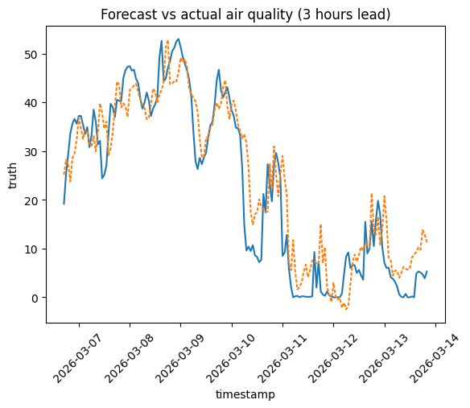

# Project Summary
Forecast air quality using a low-cost sensor.
# Data
Pre-training on: OpenQA Dataset using the Python SDK by OpenQA
# Feature engineering
We generate time series features in categories:
## Sensor data (OpenAQ API):
Sensors offer pm1, pm25, u003 values, but they are all heavily correlated, so I focus on one of them: pm25
## Date features (Pandas datetime)
- year
- month
- day_of_week
- is_weekend
- is_holiday
- hour_of_day
- sin / cos representations
## Rolling & lag
To allow the model to know more about the past, we include rolling and lag features.
- Rolling mean 12h
- Lag 3h | 6h | 9h | 12h
## Environmental (various APIs)
Initial experiments show that the base features available through the OpenAQ API (humidity and temperature) hold little explanatory power. The vast majority of forecasting accuracy comes from the lag features, and performance drops drastically as lead time increases. Therefore, I will consider the following other features:
- Wind speed
- Wind direction
- Barometric pressure
- Rain
# Target
The target is a negatively shifted pm25. This allows the model to learn how the pm25 values is different in the future.
# Experiments
## Number 1: Ridge regression, basic features, 3 hours lead

We observe some lag, indicating that the model is purely considering the past pm25 values. Feature importance supports this.

# TODOs:
- More data: Currently, the model only has 3 months of data from 2026.
- Better features: Include wind, pressure, weather
- Tuning: Use Optuna for hyperparameter search